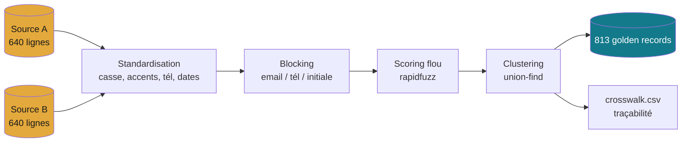

# Projet 12 — Nettoyage, standardisation & dédoublonnage (golden record)

[](https://github.com/valentinratigniet-byte/projet-12-nettoyage-standardisation-dedoublonnage/actions/workflows/ci.yml)

> Deux systèmes, deux fichiers clients, des doublons partout : « Jean Dupont »,
> « J. DUPONT », « dupont jean ». Ce projet fusionne des sources hétérogènes en un
> **référentiel unique et fiable** (golden record) par *fuzzy matching*, avec des
> règles reproductibles et **traçabilité** de chaque fusion. Angle *entity resolution*,
> complémentaire du [Projet 02](https://github.com/valentinratigniet-byte/projet-02-pipeline-nettoyage-qualite).

## 🔎 Résultat (voir [docs/rapport-dedoublonnage.md](docs/rapport-dedoublonnage.md))

Fusion de **1 280 lignes** (2 sources) → **813 golden records** (36,5 % de doublons résolus).

| Métrique (par paires, vs vérité terrain) | Score |
|---|---:|
| Précision | **97,2 %** |
| Rappel | **95,9 %** |
| F1 | **96,5 %** |

*(La vérité terrain — 800 personnes réelles — est connue car les sources sont
générées avec un `true_id` caché, jamais utilisé par le matching → l'évaluation est honnête.)*

## 🧱 Démarche



1. **Génération** de 2 exports clients incohérents ([`src/generate_sources.py`](src/generate_sources.py)) :
   casse, accents, ordre du nom, initiales, fautes, formats tél/date, champs manquants.
2. **Standardisation** ([`src/dedupe.py`](src/dedupe.py)) : sans-accent, minuscule, téléphone
   (9 derniers chiffres), dates ISO, nom normalisé.
3. **Blocking** (email, téléphone, initiale du nom) → limite les comparaisons.
4. **Scoring flou** avec `rapidfuzz` (token_sort_ratio) + règles :
   email = ancre forte ; sinon téléphone + nom ; sinon nom + date de naissance.
5. **Clustering** (union-find) → une entité par groupe de doublons.
6. **Survivorship** → golden record : par champ, valeur **la plus fréquente**, à égalité la **plus complète**.
7. **Traçabilité** : `crosswalk.csv` (row_id → golden_id) + **évaluation** précision/rappel.

Variante **SQL** ([`sql/match_trgm.sql`](sql/match_trgm.sql)) : matching flou en base
avec `pg_trgm` (similarité trigramme) + `unaccent` — rapproche casse, accents et ordre inversé.

## 🚀 Reproduire

```bash
pip install -r requirements.txt
python src/generate_sources.py   # crée data/source_a.csv + source_b.csv
python src/run.py                # dédoublonne, écrit golden + crosswalk + rapport
```

Variante SQL (dans le conteneur PostgreSQL du projet 07) :
```bash
docker exec -i p07_ecommerce_db psql -U portfolio -d ecommerce < sql/match_trgm.sql
# puis \copy des sources dans dedup.clients et requête de similarité (voir le script)
```

## 🗂️ Structure

```
projet-12-nettoyage-standardisation-dedoublonnage/
├── README.md · requirements.txt
├── src/
│   ├── generate_sources.py  ← 2 fichiers clients sales (true_id caché)
│   ├── dedupe.py            ← module : standardize/cluster/golden_record/evaluate
│   └── run.py               ← pipeline + rapport
├── sql/
│   └── match_trgm.sql       ← matching flou en base (pg_trgm + unaccent)
└── docs/
    └── rapport-dedoublonnage.md  ← avant/après + précision/rappel + exemple (généré)
```

## 🧠 Règles de survivorship

Chaque champ du golden record est la **valeur la plus fréquente** de l'entité ; en
cas d'égalité, la **plus complète** (plus longue — privilégie noms accentués vs
initiales/tronqués). Toute fusion est **traçable** via `crosswalk.csv`.

---

*Projet 12 du [Portfolio Data](https://github.com/valentinratigniet-byte). Entity resolution : créer une donnée de
référence unique — impact direct facturation, RGPD, reporting.*
